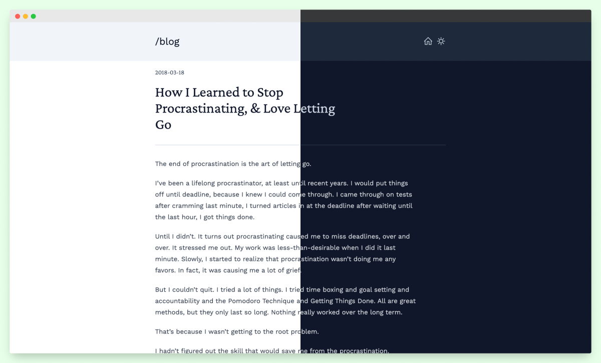

# Deployment Status
[](https://app.netlify.com/sites/pythontorust/deploys)

# Boring
Minimal theme for [Zola](https://www.getzola.org/), powered by
[TailwindCSS](https://tailwindcss.com/)

### Demo
https://boring-zola.netlify.app/



### Setup
In your zola site directory
- Get theme

    ```shell
    git submodule add https://github.com/ssiyad/boring themes/boring
    ```

- Build CSS

    ```shell
    cd themes/boring
    yarn install --frozen-lockfile
    yarn build
    ```

- Change theme specific variables. They are listed in `extra` section of
  [config.toml](./config.toml)

Refer [Zola Docs](https://www.getzola.org/documentation/themes/installing-and-using-themes/#using-a-theme)
for further instructions

### License
[GPLv3](./LICENSE)

